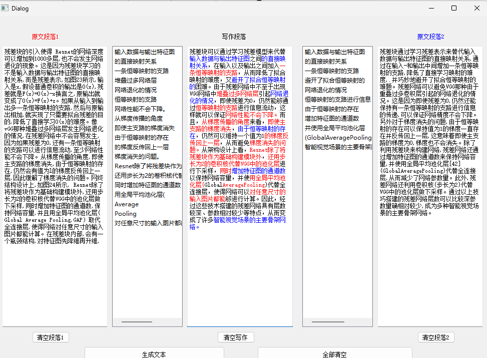

# Paper_tool
用来进行简单查重以及基于OpenAI的GPT3接口进行文章润色的小程序，使用pyqt作为GUI框架
## 使用
- 到paraphrase.py里将第7行的KEY换成自己的
- 到paraphrase.py里将第11行的openi.proxy改成自己梯子的端口
```Bash
conda env create -f environment.yml
conda activate gui
python ./strcmp.py
```
运行截图
 <!-- 此路径表示图片和MD文件，处于同一目录 -->
